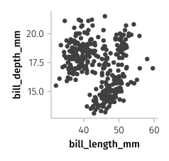
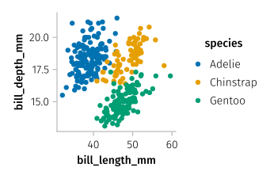
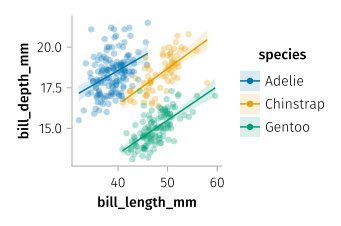
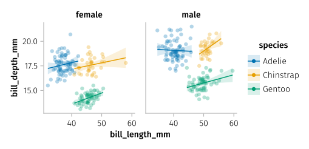
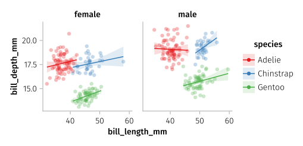

<div align="center">
  <picture>
    <source media="(prefers-color-scheme: dark)" srcset="/docs/src/assets/logo-dark.svg">
    <source media="(prefers-color-scheme: light)" srcset="/docs/src/assets/logo.svg">
    
  </picture>
</div>

# AlgebraOfGraphics

[](https://github.com/MakieOrg/AlgebraOfGraphics.jl/actions/workflows/ci.yml)
[](http://codecov.io/github/MakieOrg/AlgebraOfGraphics.jl?branch=master)
[](https://aog.makie.org/stable)
[](https://aog.makie.org/dev)

Visualize your data using a few simple building blocks that can be
composed using `+` and `*`. AlgebraOfGraphics puts a new algebraic spin
on the grammar of graphics idea known from R’s
[ggplot2](https://ggplot2.tidyverse.org/) package.

Visualizations are powered by
[Makie](https://github.com/MakieOrg/Makie.jl) and you have its full
capabilities available to tweak figures produced by AlgebraOfGraphics.

## Example

``` julia
using AlgebraOfGraphics, CairoMakie, PalmerPenguins, DataFrames

penguins = dropmissing(DataFrame(PalmerPenguins.load()))

set_aog_theme!()
update_theme!(Axis = (; width = 150, height = 150))

spec = data(penguins) * mapping(:bill_length_mm, :bill_depth_mm)

draw(spec)
```



``` julia
by_color = spec * mapping(color = :species)

draw(by_color)
```



``` julia
with_regression = by_color * (linear() + visual(alpha = 0.3))

draw(with_regression)
```



``` julia
facetted = with_regression * mapping(col = :sex)

draw(facetted)
```



``` julia
draw(facetted, scales(Color = (; palette = :Set1_3)))
```



## Acknowledgements

Analyses rely on
[StatsBase.jl](https://github.com/JuliaStats/StatsBase.jl),
[Loess.jl](https://github.com/JuliaStats/Loess.jl),
[KernelDensity.jl](https://github.com/JuliaStats/KernelDensity.jl), and
[GLM.jl](https://github.com/JuliaStats/GLM.jl). Some of their
documentation is transcribed here.

Automatic legend creation re-implements the machinery in
[TabularMakie](https://github.com/greimel/TabularMakie.jl).

Logo and favicon made with 🧡 by @dyogurt.
