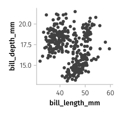
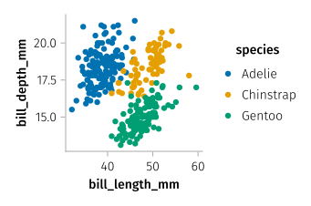
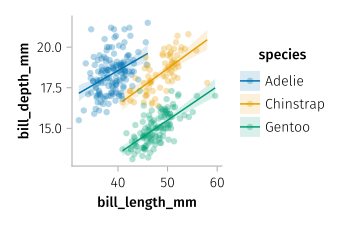
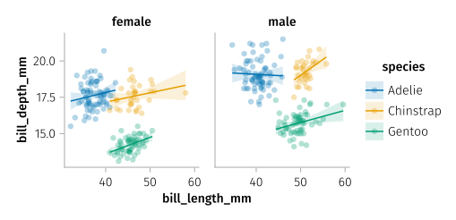
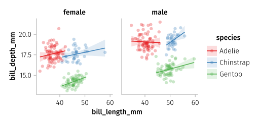

<div align="center">

<picture>
<source media="(prefers-color-scheme: dark)" srcset="/docs/src/public/logo_with_text_dark.svg">

</picture>

<p>

[](https://github.com/MakieOrg/AlgebraOfGraphics.jl/actions/workflows/ci.yml)
[](http://codecov.io/github/MakieOrg/AlgebraOfGraphics.jl?branch=master)
[](https://aog.makie.org/stable)
[](https://aog.makie.org/dev)
[](https://doi.org/10.21105/joss.10894)

</p>

</div>

Visualize your data using a few simple building blocks that can be
composed using `+` and `*`. AlgebraOfGraphics puts a new algebraic spin
on the grammar of graphics idea known from R’s
[ggplot2](https://ggplot2.tidyverse.org/) package.

Visualizations are powered by
[Makie](https://github.com/MakieOrg/Makie.jl) and you have its full
capabilities available to tweak figures produced by AlgebraOfGraphics.

## Example

``` julia
using AlgebraOfGraphics, CairoMakie

penguins = AlgebraOfGraphics.penguins()

set_aog_theme!()
update_theme!(Axis = (; width = 150, height = 150))

spec = data(penguins) * mapping(:bill_length_mm, :bill_depth_mm)

draw(spec)
```



``` julia
by_color = spec * mapping(color = :species)

draw(by_color)
```



``` julia
with_regression = by_color * (linear() + visual(alpha = 0.3))

draw(with_regression)
```



``` julia
facetted = with_regression * mapping(col = :sex)

draw(facetted)
```



``` julia
draw(facetted, scales(Color = (; palette = :Set1_3)))
```



## Citing AlgebraOfGraphics

If you use AlgebraOfGraphics for a scientific publication, please
acknowledge and support our work by citing [our JOSS
paper](https://joss.theoj.org/papers/10.21105/joss.10894) the following
way:

    Krumbiegel & Vertechi, (2026). AlgebraOfGraphics.jl: A Makie-powered algebraic grammar of graphics for Julia.
    Journal of Open Source Software, 11(123), 10894, https://doi.org/10.21105/joss.10894

<details>

<summary>

BibTeX entry:
</summary>

``` bib
@article{Krumbiegel2026,
  doi = {10.21105/joss.10894},
  url = {https://doi.org/10.21105/joss.10894},
  year = {2026},
  publisher = {The Open Journal},
  volume = {11},
  number = {123},
  pages = {10894},
  author = {Krumbiegel, Julius and Vertechi, Pietro},
  title = {{AlgebraOfGraphics.jl}: A {Makie}-powered algebraic grammar of graphics for {Julia}},
  journal = {Journal of Open Source Software}
}
```

</details>

or [download the BibTeX file](CITATION.bib).

## Contributing

See [CONTRIBUTING.md](CONTRIBUTING.md) for how to get help, report bugs,
and contribute code or documentation.

## Acknowledgements

Analyses rely on
[StatsBase.jl](https://github.com/JuliaStats/StatsBase.jl),
[Loess.jl](https://github.com/JuliaStats/Loess.jl),
[KernelDensity.jl](https://github.com/JuliaStats/KernelDensity.jl), and
[GLM.jl](https://github.com/JuliaStats/GLM.jl). Some of their
documentation is transcribed here.
